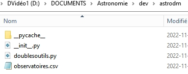
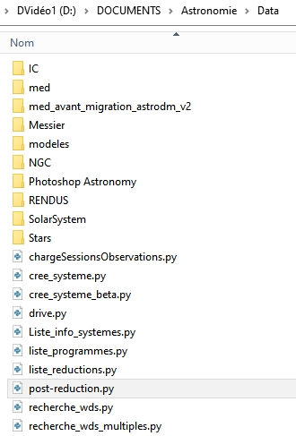
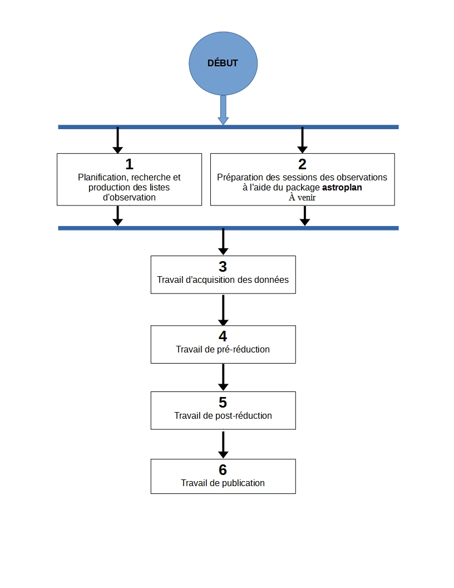
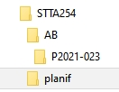
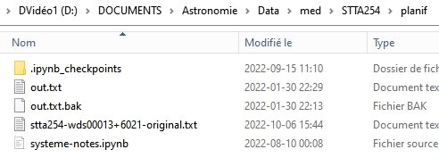
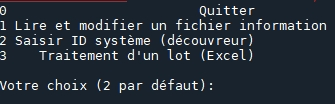
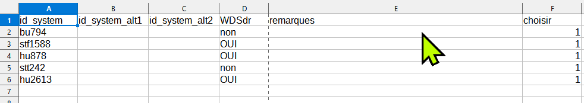
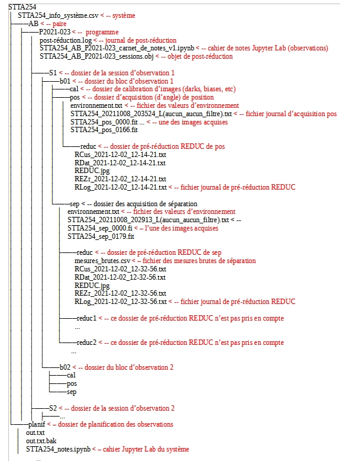
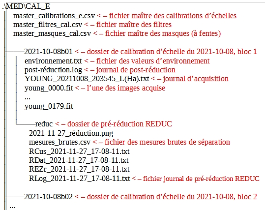

# Package astrodm

## INTRODUCTION

Le package astrodm; [**a**stronomie **d**oubles **m**esures] contient un seul module : **doublesoutils**, écrit en langage Python. Ce module comprend différentes classes d'objets qui exposent des méthodes et des attributs qui visent à assister l'observateur dans la planification et le suivi des observations ainsi que la réduction des mesures de l'angle de position ( $\theta$ ) et la séparation ( $\sigma$ ) des étoiles doubles.

astrodm propose également des scripts d'exploitation qui permettent de produire différentes listes afin d'assister à la planification et au suivi, au jour le jour des observations.

### Mode d'exploitation du package

Ce package ne nécessite aucune installation (voir figure 1) car il est destiné à être exécuté dans un IDE, par exemple Anaconda. Chaque script d'exploitation indiqué plus bas, lorsqu'exécuté dans le terminal d'un tel IDE, comprend un point d'entrée qui prépare l'environnement d'exécution pour l'importation du package astrodm. Lorsqu'un script se termine, l'espace de nom des variables est complètement préservé. De cette façon, certaines variables qui contiennent des objets demeurent disponibles avec leur méthodes et leurs attributs. Par exemple, le contenu d'une liste pourra être modifié et triée différemment.

### Emplacement du package


Figure 1 : Emplacement du package astrodm.

### Les scripts d'exploitation

La figure 2 donne la liste des scripts et montre également l'emplacement des scripts d'exploitation. Il est recommandé d'exécuter les scripts dans le répertoire **data**, car certains scripts exploitent automatiquement le contenu des sous-répertoires **med** et **modeles** situés dans **data**, alors que d'autres scripts permettent la sélection interactive du répertoire de données.



Figure 2 : Emplacement des scripts d'exploitation. Les répertoires **med** et **modeles** sont automatiquement exploités par certains scripts.


### Définition du temps

Le temps de l’ordinateur portable d’acquisition des données (Windows 10) est UTC-5 ou UTC-4 (heure d'été). L’heure du système est réglée par NTP au début de chaque session d’observation. Ainsi, durant les observations, les logiciels utilisés pour les acquisitions auront accès à un  temps local le plus exact possible. Cependant, comme il est coutume en astronomie, toutes les observations sont rapportées en temps UTC (temps universel coordonné).

### Format du temps utilisé par astrodm

Toutes les dates UTC sont au format (texte) isot de la classe **astropy.Time**. Par exemple, le 8 octobre 2021 à 22h 45m 56.478s UTC sera codé comme suit : ‘2021-10-08T22:45:56.478UTC’.

### Observation des étoiles doubles - sommaire des flux de travail

Ma méthodologie de travail se décline en six flux de travail :

 1. Planification et recherche
 2. Préparation des sessions d'observations (astropy)
 3. Acquisition des données
 4. Pré-réduction des données d'observations
 5. Post-réduction des données d'observations
 6. Publication des résultats


Figure 3 - Cheminement des six flux de travail d'observation d'étoiles doubles.

### Petit lexique

Quelques notes concernant le vocabulaire utilisé dans ce repo.

* WDS : le Washington Doubles Star Catalog.
* système : un système d'étoiles doubles (ou multiples) en général, selon la désignation de découvreur du WDS (Discoverer & Number); par ex. STTA 254 ou STF 60.
* paire : désignation de la paire, par ex. AB, A,BC selon l'appartenance dans le catalogue WDS.

## 1.0 Travail de planification et recherche

### Description

Ce flux de travail commence d'abord par la création, à l'aide d'un script, de la structure de répertoires et des fichiers de bases qui appartiennent au système (figure 4).  Les recherches au sujet du système se poursuivent dans les bases de données en-ligne, les livres et les site web pour documenter le système étudié. Les notes issues de ce travail sont consignées dans un cahier Jupyter Lab (figure 5) qui se trouve dans le répertoire **planif** du système.

Ce travail permettra par la suite d'identifier les paires qui méritent d'être observées au sein du système étudié.

La figure 4 montre le répertoire du système STTA254 : un sous-répertoire est créé pour chaque paire sélectionnée pour ce système et finalement un autre sous-répertoire nommé avec le numéro du programme d'observation est créé afin d'assigner ce programme d'observation à cette combinaison système-paire. C'est ce programme d'observation qui facilitera le suivi de toutes les activités d'acquisition de données d'observations et de pré/post-réductions des données.



Figure 4 - Structure des répertoires du système WDS STTA254. Le programme d'observation P2021-023 est assigné à la paire AB.



Figure 5 - Contenu du sous-répertoire **planif** du système WDS STTA254. Le cahier Jupyter Lab « systeme-notes.ipynb » contient les notes de recherche du système.

## 1.1 - Création de la structure de base des répertoires d'un système

* Script : cree_systeme.py
* Mode : IDE (SPYDER), menus et autres intéractions.
* Sortie : au terminal IPython pour les interractions.
* Retourne : Sous-répertoires créés dans le répertoire **med**.
* Fonctionnalités supplémentaire :
* * Seuls les systèmes valides (qui existent dans le WDS) peuvent être créés.
* * Seulement lors de création initiale du dossier, le script copie le modèle du cahier Jupyter «système_notes.ipynb»’ dans dossier planif du système. Ce fichier sert de modèle pour les cahiers d’observation qui se trouveront dans le dossier de chaque paire / programme.
 



Figure 6 - Menu du script cree-systeme.py

### PROCÉDURE

1.1.1 Option 1 - Sélection, lecture et modification d'un fichier information de système : lit un fichier *_info_système.csv et permet de le modifier.

1.2.2 Option 2 Saisie de l'ID WDS du système : pour créer un système à neuf. Vérifie si dossier existe déjà et demande de confirmer exécution.

ATTENTION si exécution confirmée, les informations originales seront écrasées.

1.2.3 Option 3 -  Traitement d'un lot dans une feuille de calcul : choisir avec 1 dans colonne « choisir » (colonne E).

    * inscrire 1 dans la colonne « choisir »
    * toutes les informations seront mises à jour dans _informations.csv si dossier existe
    * exécuter autant de fois que désiré.
    * le log de chaque exécution se trouve dans .\planif\LOTS.



Figure 7: Exemple de la structure d'un fichier de traitement en lot. Seules les colonnes A et E sont obligatoires. Inscrire 1 dans la colonne « choisir » pour assurer le traitement.

## 1.2 - Création des listes de suivi
    1.2.1 Liste des fichiers d'information des systèmes pour l'ensemble du répertoire **med** :

* Script : Liste_info_systemes.py
* Mode : IDE (SPYDER), sélection interactive de l'ordre de tri.
* Sortie : au terminal IPython ou capture dans un fichier texte.
* Retourne : la variable _info-systèmes_df_ qui contient la liste sous forme d'un dataframe Pandas.
* Fonctionnalités supplémentaires : les méthode suivantes du dataframe Pandas permettent de changer la sélection et l'ordre de tri. TODO.
* Pour exemples voir <https://github.com/stardom1957/med-planification/tree/main/LISTES>, fichiers qui commencent par « info-sys-par( ».

    1.2.2 Liste des programmes d'observation et de leurs états

* Script : liste_programmes.py
* Mode : IDE (SPYDER), sélection interactive de l'ordre de tri.
* Sortie : au terminal IPython ou capture dans un fichier texte.
* Retourne : la variable _liste_des_programmes_df_ qui contient la liste sous forme d'un dataframe Pandas.
* Fonctionnalités supplémentaires : les méthode suivantes du dataframe Pandas permettent de changer la sélection et l'ordre de tri. TODO.
* Pour exemples voir <https://github.com/stardom1957/med-planification/tree/main/LISTES>, fichiers qui commencent par « prog-obs-par( ».

## 2.0 Travail de planification des observations - éphémérides

À développer. TODO.

## 3.0 Travail d'acquisition des données d'observation

Pré-requis

- La structure de fichiers des figures 4 et 5 doivent être respectées à la lettre.

PROCÉDURE

3.1 Structure de fichiers des acquisitions d’observation pos (angle de position) et sep (séparation) :: voir figure 4.

3.2. Structure de fichiers des acquisitions ech (échelle) :: voir figure 5.

3.3. Acquisition des données de calibration d’échelle (ech)

    3.3.1. Dossier sous la forme .\cal_e\AAAA-MM-JJb01 : chaque acquisition b02, b03, ..., etc.

    3.3.2. fichier environnement .txt, modèle dans .\Data\modèles\AAAA-MM-JJb01

3.4. Acquisition des données de séparation (sep)

3.5. Acquisition des données (d’angle) de position (pos)



Figure 4 : Exemple de structure des données pour l’acquisition de sep et pos



Figure 5 : Exemple de structure des fichiers d'acquisition ech (d'échelle)

## 4.0 Travail de pré-réduction

Pré-requis

- Structure de données selon figure 5 pour acquisition d'observation ou 6 pour une acquisition d'échelle.

### Utilisation de REDUC

La pré-réduction s’effectue avec le logiciel REDUC en travaillant simultanément dans deux instances de ce logiciel : une instance s’occupe de la réduction de pos et l’autre celle de sep.

À l’aide de REDUC, la procédure de réduction complète suivante est répétée pour chaque bloc d’observation (b01, b02, …).

### SOMMAIRE Pré-réduction POS et SEP

On effectue d’abord la réduction de POS afin d’obtenir l’orientation de l’image delta_matrix. Le log de la réduction POS est inscrit dans un fichier Rlog… pos\reduc\Rlog*.txt.  On effectue ensuite (ou simultanément) la réduction de sep et on copie le delta_matrix de pos dans delta_matrix de sep. Le log de la réduction sep est versé dans un fichier Rlog… dans sep\reduc.

PROCÉDURE

4.1 Pré-réduction ‘complete’ (pos et sep):

    4.1.1. pos : voir logigramme PRÉ-RÉDUCTION-POS

    4.1.2. sep :  voir logigramme PRÉ-RÉDUCTION-SEP-ECH

4.2. Pré-réduction d'échelle (‘ech’) : voir logigramme PRÉ-RÉDUCTION-SEP-ECH

## 5.0 Travail de post-réduction

Pré-requis

- peut être exécutée à n’importe quel moment lorsque qu’il y a au moins une pré-réduction complétée pour un des blocs d’une session.

PROCÉDURE

5.1. Post-réduction :

    5.1.1. Au terminal ipython (Spyder, par ex. ) : exécuter le script reduction_*.py. Il s’agit du mode interactif; le script demande le chemin du programme et exécute la réduction.

    5.1.2. Dans le cahier de notes Jupyter Lab, exécuter la ligne suivante :

```do.post_reduction(type_session='complete', ch_prog=’chemin_du_programme’)```

    5.1.3. Suite à la post-réduction, dans les deux cas :
    - le log de post-réduction «post-réduction.log» placé dans le dossier de programme donne un bref apperçu du résultat de la post-réduction.
    - Le fichier ‘*_sessions.obj’ est un pickle d’un objet de classe astrodm.DoubleSessionsComplete.

5.2. Exploitation de l’objet issue du script du script reduction *.py.
