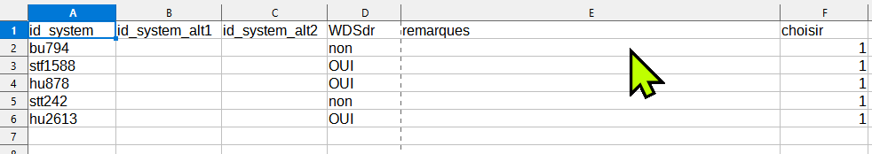
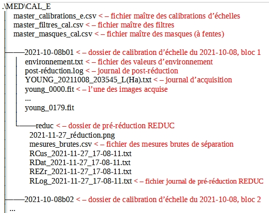

# Package astrodm

## Emplacement du package


Figure 1 : Liste des modules opérationnels du package astrodm.


Figure 2 : Archives des modules de développement du package astrodm.

## Structure générale de développement

Le dossier astrodm (figure 1) contient les versions opérationnelles des modules. Le sous dossier dev/ VERSIONS_DE_DÉVELOPPEMENT (figure 2) contient les différentes versions des modules qui y sont versés avec un no de version en suffixe. Le no de version est inscrit dans les commentaires au début de chaque module et peut être obtenu avec la méthode version() du module.

## Définition du temps

Le temps de l’ordinateur portable d’acquisition des données (Windows 10) est UTC-5 ou UTC-4 (heure d'été). L’heure du système est réglée par NTP au début de chaque session d’observation. Ainsi, lors des acquisitions, Firecapture pourra inscrire dans son log le temps local et le temps UTC. Le temps UTC n’a pas de changement d’heure pour l’heure d’été et de toute façon, doit être utilisé pour le calculs des éphémérides.

## Format du temps

Toutes les chaînes de caractères qui contiennent une date sont au format isot UTC de astropy.Time. Par exemple : ‘2021-10-08T22:45:56.478UTC’.

Dans les logs produits par Firecapture, les dates au format UTC à récupérer sont :

Date=  (le système étant à l'heure locale, il faudra vérifier si la date est correcte après minuit.
Mid(UT)= cette valeur est utilisée pour le temps des observations.

Les autres date et heure présentes dans le fichier ne sont pas utilisées.

## Exploitation du package - différents flux de travail

## 1.0 Travail de planification – astrométrie et documentation

Pré-requis

- Script Python
- Préférablement Spyder, console, charger «cree_systeme_*.py»

PROCÉDURE

1.1 Choisir l’un des modes suivants et suivre les instructions :

    1.1.1     ‘Lire fichier information'

        1.1.1.1. lit un fichier *_info_système.csv et permet de le modifier.

1.2.   'Saisir ID système' pour créer un système à neuf. Vérifie si dossier existe déjà et demande de confirmer exécution.

ATTENTION si exécution confirmée, les informations originales seront écrasées.

1.3. "Traitement d'un lot (Excel)"

    1.3.1. choisir avec 1 dans colonne choisir

    1.3.2. toutes les informations seront mises à jour dans _informations.csv si dossier existe

    1.3.3. exécuter autant de fois que désiré.

    1.3.4. le log de chaque exécution se trouve dans .\planif\LOTS.



Figure 3: Exemple de la structure d'un fichier de traitement en lot. Seules les colonnes A et E sont obligatoires. Choisir pour traitement ==1.

1.4 Création du cahier Jupyter pour le système :

    1.4.1. Seulement lors de création initiale du dossier, le script copie le modèle du cahier Jupyter «système_notes.ipynb»’ dans dossier planif du système. Ce fichier sert de modèle pour les cahiers d’observation qui se trouveront dans le dossier de chaque paire / programme.

    1.4.2. Copier ce fichier dans le dossier de programme et renommer à souhait.

    1.4.3 Ouvrir le cahier et éditer le contenu.

## 2.0 Travail de planification des observations - éphémérides

À développer.

## 3.0 Travail d'acquisition des données d'observation

Pré-requis

- La structure de fichiers des figures 4 et 5 doivent être respectées à la lettre.

PROCÉDURE

3.1 Structure de fichiers des acquisitions d’observation pos (angle de position) et sep (séparation) :: voir figure 4.

3.2. Structure de fichiers des acquisitions ech (échelle) :: voir figure 5.

3.3. Acquisition des données de calibration d’échelle (ech)

    3.3.1. Dossier sous la forme .\cal_e\AAAA-MM-JJb01 : chaque acquisition b02, b03, ..., etc.

    3.3.2. fichier environnement .txt, modèle dans .\Data\modèles\AAAA-MM-JJb01

3.4. Acquisition des données de séparation (sep)

3.5. Acquisition des données (d’angle) de position (pos)


Figure 4 : Exemple de structure des données pour l’acquisition de sep et pos



Figure 5 : Exemple de structure des fichiers d'acquisition ech (d'échelle)

## 4.0 Travail de pré-réduction

Pré-requis

- Structure de données selon figure 5 pour acquisition d'observation ou 6 pour une acquisition d'échelle.

### Utilisation de REDUC

La pré-réduction s’effectue avec le logiciel REDUC en travaillant simultanément dans deux instances de ce logiciel : une instance s’occupe de la réduction de pos et l’autre celle de sep.

À l’aide de REDUC, la procédure de réduction complète suivante est répétée pour chaque bloc d’observation (b01, b02, …).

### SOMMAIRE Pré-réduction POS et SEP

On effectue d’abord la réduction de POS afin d’obtenir l’orientation de l’image delta_matrix. Le log de la réduction POS est inscrit dans un fichier Rlog… pos\reduc\Rlog*.txt.  On effectue ensuite (ou simultanément) la réduction de sep et on copie le delta_matrix de pos dans delta_matrix de sep. Le log de la réduction sep est versé dans un fichier Rlog… dans sep\reduc.

PROCÉDURE

4.1 Pré-réduction ‘complete’ (pos et sep):

    4.1.1. pos : voir logigramme PRÉ-RÉDUCTION-POS

    4.1.2. sep :  voir logigramme PRÉ-RÉDUCTION-SEP-ECH

4.2. Pré-réduction d'échelle (‘ech’) : voir logigramme PRÉ-RÉDUCTION-SEP-ECH

## 5.0 Travail de post-réduction

Pré-requis

- peut être exécutée à n’importe quel moment lorsque qu’il y a au moins une pré-réduction complétée pour un des blocs d’une session.

PROCÉDURE

5.1. Post-réduction :

    5.1.1. Au terminal ipython (Spyder, par ex. ) : exécuter le script reduction_*.py. Il s’agit du mode interactif; le script demande le chemin du programme et exécute la réduction.

    5.1.2. Dans le cahier de notes Jupyter Lab, exécuter la ligne suivante :

```do.post_reduction(type_session='complete', ch_prog=’chemin_du_programme’)```

    5.1.3. Suite à la post-réduction, dans les deux cas :
    - le log de post-réduction «post-réduction.log» placé dans le dossier de programme donne un bref apperçu du résultat de la post-réduction.
    - Le fichier ‘*_sessions.obj’ est un pickle d’un objet de classe astrodm.DoubleSessionsComplete.

5.2. Exploitation de l’objet issue du script du script reduction *.py.
